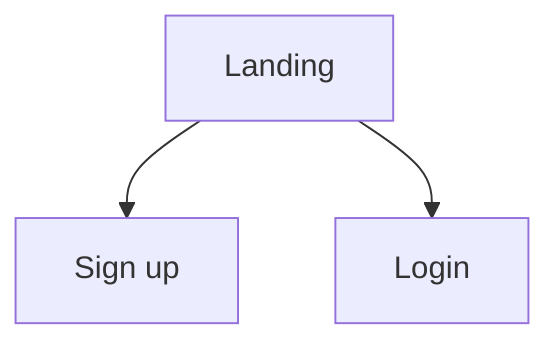

# Template: `.ai/03-APP-FLOW.md`

Purpose: defines every screen, every route, and every path a user can take. No visual styling here (that belongs in UI/UX).

## Required structure

```markdown
# APP FLOW: <Project Name>
> File purpose: screens, navigation, user journeys. Depends on: 01-PRD.md, 02-TRD.md.

## 1. Screen Inventory
| ID | Screen | Route / Entry | Access (public/auth/role) | Related features |
|----|--------|---------------|---------------------------|------------------|
| S-01 | Landing | / | public | F-01 |

## 2. Navigation Map
(Mermaid flowchart or ASCII tree showing how every screen connects.)



## 3. User Journeys
### J-01: <Journey name> (persona U-01)
| Step | User action | System response | Next screen |
|------|-------------|-----------------|-------------|
| 1 | | | |
Success end state:
Failure branches: (what happens on each error)

## 4. Screen Details
### S-01: <Screen name>
- Purpose:
- Entry points: (from which screens/actions)
- Data displayed: (entities from BACKEND SCHEMA, by name)
- User actions available:
  | Action | Trigger | Result | API used |
  |--------|---------|--------|----------|
- States: loading / empty / error / success / offline (describe each)
- Exit points:
(repeat for every screen)

## 5. Global Behaviors
- Auth guard rules and redirects
- 404 / error page behavior
- Session expiry behavior
- Back-button and deep-link behavior

## 6. Forms and Validation
| Form | Field | Rule | Error message (exact text) |
|------|-------|------|----------------------------|
```

## Notes
- Every screen reachable from the nav map must be in the inventory, and vice versa.
- Use exact error and success message text so the AI does not invent wording.
